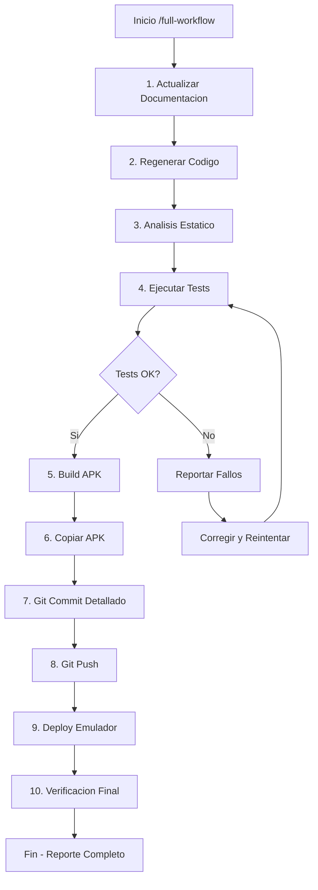

# /full-workflow - Workflow Completo de Desarrollo

Automatiza el ciclo completo: documentacion, testing, build, git y deploy.

## Diagrama de Flujo



## Pasos del Workflow

### 1. Actualizar Documentacion
```bash
# Archivos actualizados automaticamente:
# - README.md (version, estadisticas)
# - docs/USER_MANUAL.md (version, fecha)
# - docs/WALKTHROUGH.md (flujos actuales)
# - CHANGELOG.md (nuevos cambios)
```

### 2. Regenerar Codigo
```bash
flutter pub get
dart run build_runner build -d
```

### 3. Analisis Estatico
```bash
flutter analyze
```

### 4. Ejecutar Tests (500+)
```bash
# Tests criticos (deben pasar)
flutter test test/unit/ test/widget/ test/integration/

# Tests adicionales (reportar estado)
flutter test test/pwa/ test/performance/ test/supabase/
```

### 5. Build APK Release
```bash
flutter build apk --release
```

### 6. Copiar APK
```bash
cp build/app/outputs/flutter-apk/app-release.apk \
   ~/Descargas/finanzas-familiares-v{VERSION}.apk
```

### 7. Git Commit Detallado
```bash
git add -A
git commit -m "$(cat <<'EOF'
feat/fix/chore(scope): Descripcion concisa

## Cambios
- Cambio principal 1
- Cambio principal 2
- Cambio principal 3

## Tests
- X tests pasados
- X tests fallidos (no criticos)

## Documentacion
- README.md actualizado
- USER_MANUAL.md actualizado
- WALKTHROUGH.md actualizado

Generated with [Claude Code](https://claude.com/claude-code)

Co-Authored-By: Claude Opus 4.5 <noreply@anthropic.com>
EOF
)"
```

### 8. Git Push
```bash
git push origin main
# O con --force si se requiere
git push origin main --force
```

### 9. Deploy Emulador
```bash
# Verificar emulador activo
adb devices

# Instalar APK
adb install -r build/app/outputs/flutter-apk/app-release.apk
```

### 10. Verificacion Final
Reportar:
- Version desplegada
- Numero de tests pasados/fallidos
- Tamano del APK
- Commit hash
- Estado del emulador

## Uso

```
/full-workflow
```

## Variantes

| Comando | Descripcion |
|---------|-------------|
| `/full-workflow` | Workflow completo |
| `/full-workflow --skip-tests` | Sin tests (emergencias) |
| `/full-workflow --no-push` | Solo commit local |
| `/full-workflow --no-deploy` | Sin instalacion |
| `/full-workflow --force` | Push forzoso |

## Skills Utilizados

- `testing` - Suite de tests
- `sync-management` - Verificar sync offline
- `flutter-architecture` - Validar estructura
- `financial-analysis` - Validar calculos

## Hooks Activados

| Hook | Momento | Accion |
|------|---------|--------|
| `pre-build` | Antes de build | Ejecuta tests criticos |
| `post-build` | Despues de build | Copia APK a releases/ |
| `pre-commit` | Antes de commit | Valida formato |
| `post-test-write` | Al crear test | Sugiere setup |

## Notas Importantes

1. El workflow se detiene si tests criticos fallan
2. Tests E2E pueden fallar sin bloquear (buscan UI especifica)
3. Push forzoso solo con confirmacion explicita
4. Emulador debe estar corriendo para deploy
