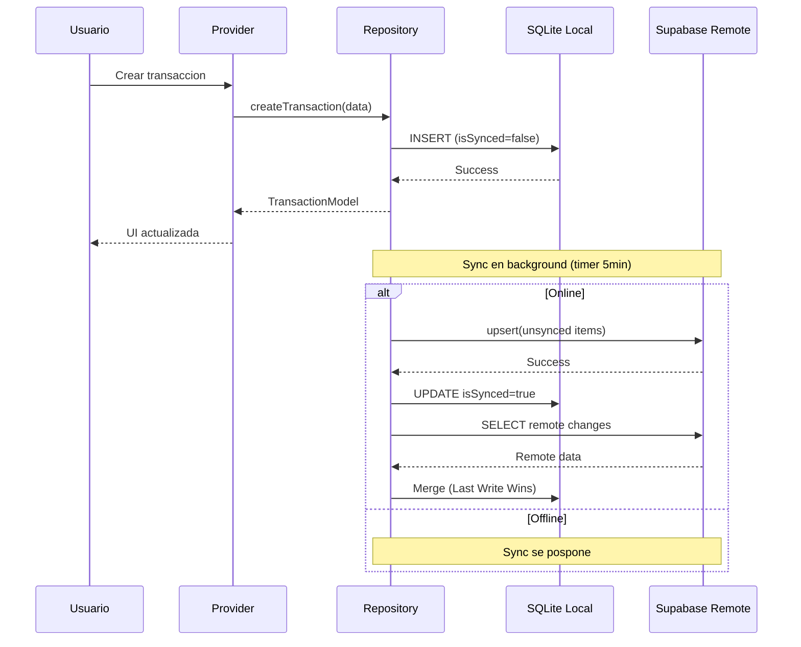
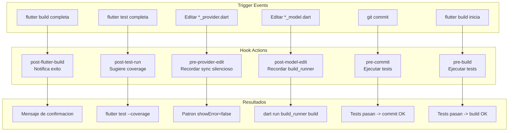
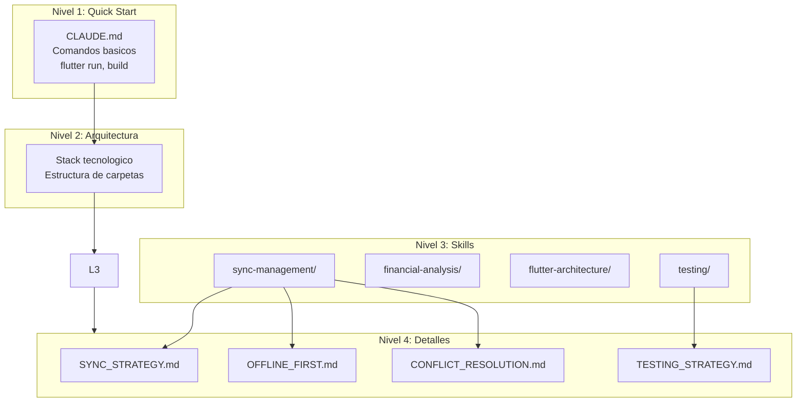
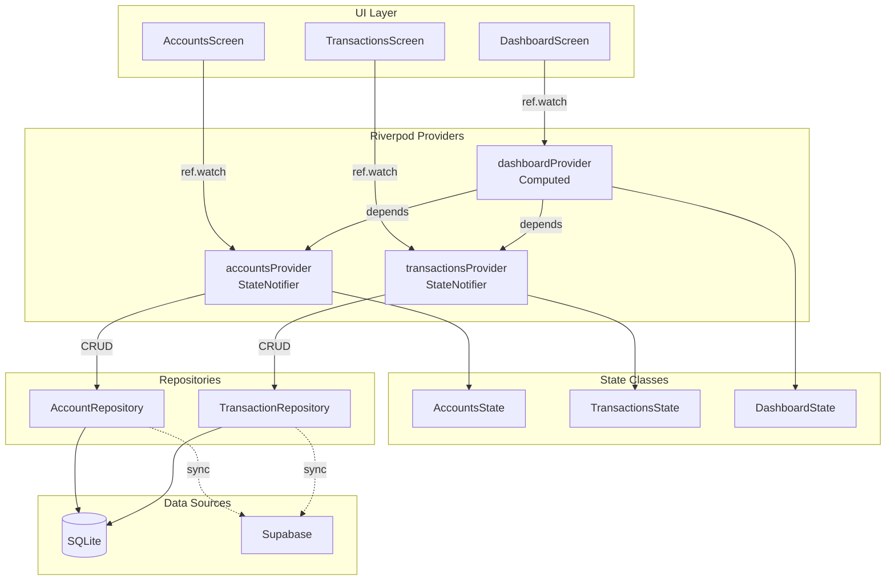

# Flujo de Trabajo .claude - Finanzas Familiares

Diagrama del sistema de automatizacion y Progressive Disclosure implementado en `.claude/`.

## Diagrama Principal

```mermaid
flowchart TB
    subgraph User["Usuario"]
        U[Desarrollador/Claude]
    end

    subgraph ClaudeConfig[".claude Configuration"]
        CM[CLAUDE.md<br/>Progressive Disclosure]

        subgraph Skills["Skills Layer"]
            S1[sync-management]
            S2[financial-analysis]
            S3[flutter-architecture]
            S4[testing]
        end

        subgraph Commands["Commands Layer"]
            C1[/build-apk]
            C2[/run-tests]
            C3[/sync-check]
            C4[/analyze-finances]
            C5[/pre-release]
            C6[/deploy]
        end

        subgraph Hooks["Hooks Layer"]
            H1[post-flutter-build]
            H2[post-test-run]
            H3[pre-provider-edit]
            H4[post-model-edit]
            H5[pre-commit]
            H6[pre-build]
        end
    end

    subgraph App["Finanzas Familiares App"]
        subgraph Core["Core Layer"]
            DB[(Drift/SQLite)]
            SB[Supabase Client]
            RT[Router]
            TH[Theme]
        end

        subgraph Features["Features Layer"]
            F1[Auth]
            F2[Accounts]
            F3[Transactions]
            F4[Budgets]
            F5[Goals]
            F6[Reports]
            F7[AI Chat]
            F8[Family]
        end

        subgraph Providers["State Management"]
            P1[Account Provider]
            P2[Transaction Provider]
            P3[Budget Provider]
            P4[Goal Provider]
        end
    end

    subgraph Testing["Testing Suite"]
        T1[Unit Tests]
        T2[Widget Tests]
        T3[Integration Tests]
        T4[AI Chat Tests]
        T5[Security Tests]
        T6[Performance Tests]
        T7[PWA Tests]
        T8[Android Tests]
        T9[Production Tests]
    end

    subgraph Output["Build Output"]
        APK[Android APK]
        LIN[Linux Binary]
    end

    %% User interactions
    U --> CM
    U --> Commands

    %% CLAUDE.md references skills
    CM --> Skills

    %% Commands trigger actions
    C1 --> APK
    C2 --> Testing
    C5 --> Testing
    C5 --> APK
    C6 --> APK

    %% Hooks automate workflows
    H1 --> APK
    H3 --> Providers
    H4 --> DB
    H5 --> Testing
    H6 --> Testing

    %% Skills provide knowledge
    S1 --> Providers
    S2 --> Features
    S3 --> Core
    S4 --> Testing

    %% App architecture
    Core --> Features
    Features --> Providers
    Providers --> DB
    Providers --> SB

    %% Sync flow
    DB <-->|Offline-First| SB
```

## Flujo de Sincronizacion Offline-First



## Flujo de Commands

```mermaid
flowchart LR
    subgraph Commands
        C1[/build-apk]
        C2[/run-tests]
        C3[/sync-check]
        C4[/pre-release]
        C5[/deploy]
    end

    subgraph Actions
        A1[flutter build apk --release]
        A2[flutter test]
        A3[Verificar providers sync]
        A4[Tests + Build + Validate]
        A5[Build + Copy to releases/]
    end

    subgraph Outputs
        O1[APK en build/]
        O2[Test results]
        O3[Sync report]
        O4[Release candidate]
        O5[APK en releases/]
    end

    C1 --> A1 --> O1
    C2 --> A2 --> O2
    C3 --> A3 --> O3
    C4 --> A4 --> O4
    C5 --> A5 --> O5
```

## Flujo de Hooks



## Progressive Disclosure Structure



## Arquitectura de Testing

```mermaid
flowchart TB
    subgraph TestSuite["Suite de Tests (300+)"]
        subgraph Unit["Unit Tests"]
            U1[Models]
            U2[Repositories]
            U3[Utils]
        end

        subgraph Widget["Widget Tests"]
            W1[Screens]
            W2[Components]
            W3[Forms]
        end

        subgraph Integration["Integration Tests"]
            I1[User Flows]
            I2[E2E Scenarios]
        end

        subgraph Specialized["Specialized Tests"]
            SP1[AI Chat]
            SP2[Security]
            SP3[Performance]
            SP4[PWA/Offline]
            SP5[Android Compat]
            SP6[Production]
        end
    end

    subgraph Commands["Test Commands"]
        C1[/run-tests]
        C2[/quick-test]
        C3[/test-category]
        C4[/pre-release]
    end

    C1 --> TestSuite
    C2 --> Unit
    C2 --> Widget
    C3 --> Specialized
    C4 --> TestSuite
```

## Flujo de Estado con Riverpod



---

## Leyenda

| Simbolo | Significado |
|---------|-------------|
| `-->` | Flujo directo |
| `-.->` | Flujo opcional/async |
| `<-->` | Bidireccional |
| `[(DB)]` | Base de datos |
| `[/cmd]` | Comando slash |

---

**Version**: 1.8.0
**Ultima actualizacion**: 2026-01-03
